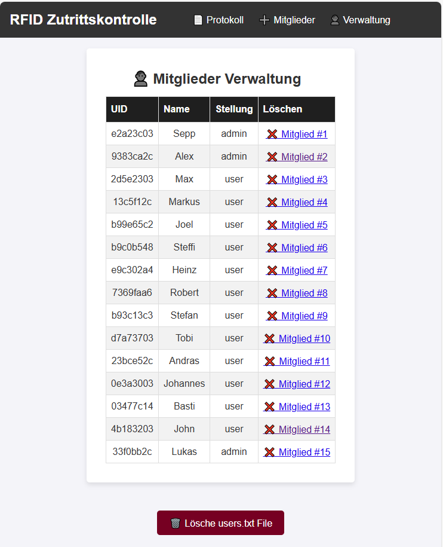
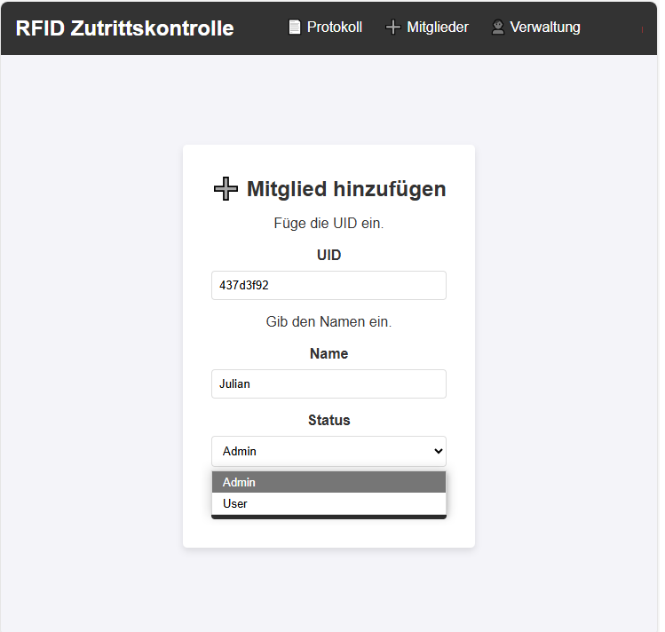

|[:skull:ISSUE](https://github.com/frankyhub/RFID-Zutrittskontrolle/issues?q=is%3Aissue)|[:speech_balloon: Forum /Discussion](https://github.com/frankyhub/RFID-Zutrittskontrolle/discussions)|[:grey_question:WiKi](https://github.com/frankyhub/RFID-Zutrittskontrolle/wiki)||
|--|--|--|--|
| | | | |
||<a href="https://github.com/frankyhub/RFID-Zutrittskontrolle/issues">|<a href="https://github.com/frankyhub/RFID-Zutrittskontrolle/discussions">|<a href="https://github.com/frankyhub/RFID-Zutrittskontrolle/releases">|
|| <a href="https://github.com/frankyhub/RFID-Zutrittskontrolle/pulse" alt="Activity">| <a href="https://github.com/frankyhub/RFID-Zutrittskontrolle/graphs/traffic">  |<a href="https://github.com/frankyhub?tab=stars"> |

# RFID-Zutrittskontrolle

## Story
Dieses Projekt umfasst eine Zutrittskontrolle mit einem RFID-Benutzerverwaltungssystem auf einem Webserver. Der ESP32 ist mit einem MFRC522 RFID-Lesegerät und einer microSD-Karten Modul verbunden. Auf der SD-Karte werden alle Benutzerdaten gespeichert. Der WEB-Server umfasst eine Zutritts-Protokoll in dem alle Zutritte mit Datum, Uhrzeit, UID (UID = Unique Identification), Name und Status (User oder Admin) gespeichert sind. Nicht erfasste RFID-Karten haben den Status "unbekannt".
Zutrittsberechtigte Personen erfasst man auf der WEB-Seite "Mitglieder". Auf dieser Seite speichert man die UID, den Namen und den Status der zutrittsberechtigten Person. In der Mitglieder-Veraltung sind alle zutrittsberechtigten Personen gelistet. Auf dieser Seite besteht die Möglichkeit zutrittsberechtigte Personen zu löschen.
Wird Zugang gewährt, geht der GPIO 22 auf HIGH und erteilt die Freigabe (Relais), der GPIO 4 zeigt einen unbekannten User an. Ein Zutritt wird nicht erteilt.

## Hardware

| Anzahl | Bezeichnung | 
| -------- | -------- | 
| 1        | ESP32 DOIT DEVKIT V1 Board       | 
| 1        | MFRC522 RFID Reader/Writer        | 
| 1        | MicroSD Card Module        | 
| 2        | 5mm LED   (Relais)     | 
| 2        | 220 Ohm    |
| -------- | -------- | 

---

   
<ol class="breadcrumb" style="border-top: 2px solid black;border-bottom:2px solid black; height: 45px; width: 900px;"> 
<a href="#oben">nach oben</a>
</ol>

  

---

